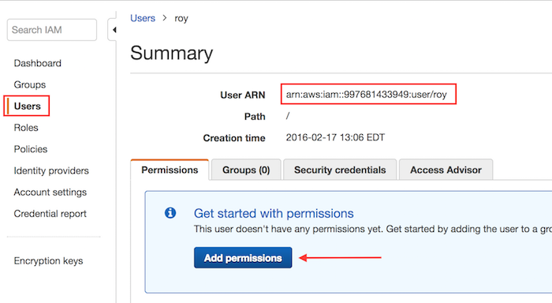
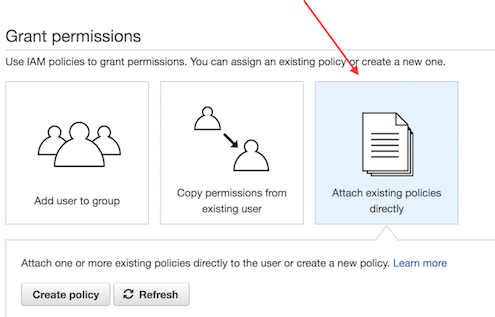
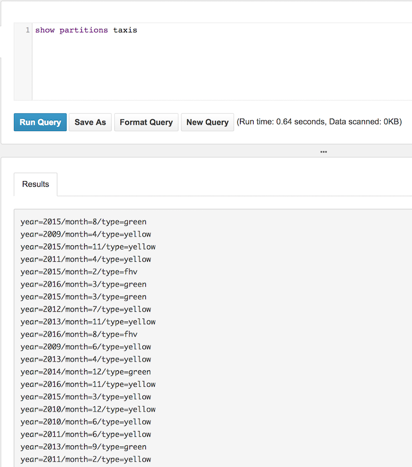
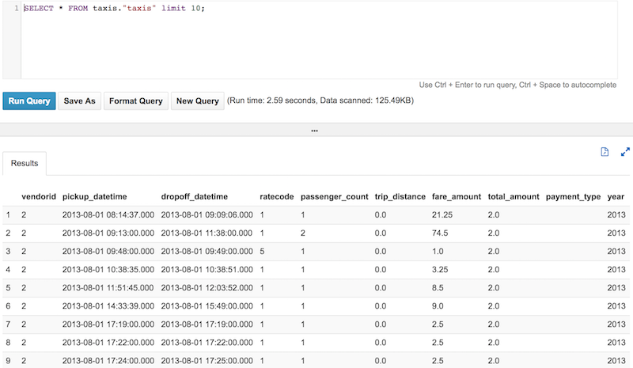
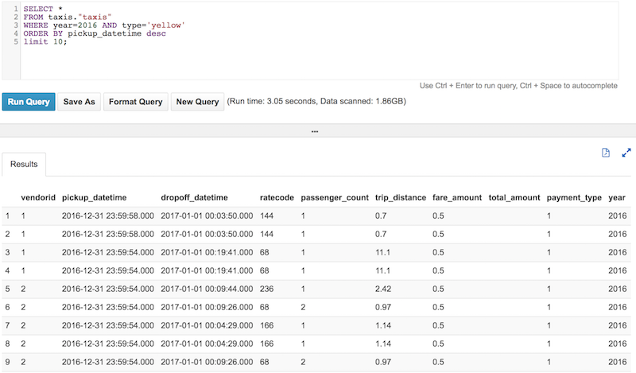

# Part 1 - Exploring NYC Taxi public data set

## Prerequisits
1. Create an [AWS account](https://aws.amazon.com/free/)
2. [NYC Taxi rides](http://www.nyc.gov/html/tlc/html/about/trip_record_data.shtml) dataset we'll be working with

## Setup IAM Permissions for Athena
1. Access the IAM console and select **Users**.  Then select your username

2. If you already have **AdministrorAccess** policy associated with your account you can skip the permission steps.

3. Click **Add Permissions** button



4. Select **Attach Existing Policies Directly**



5. From the list of managed policies, attach the following:
	* AmazonAthenaFullAccess
	* AWSQuicksightAthenaAccess
	* AmazonS3FullAccess

## Creating an Athena Table
We will be using the NYC Public Taxi dataset for this exercise available in **s3://serverless-analytics/canonical/NY-Pub/**

1. Open the Athena console

2. Before we can create our table, lets first create a database by entering `CREATE DATABASE taxis` into the **Query Editor** box and clicking **Run Query**.
Once created, make sure the `taxis` database is selected in the Database drop down on the left hand side.

3. Next we create our table schema. In the Query Editor box, enter the following and click **Run Query**

```sql
CREATE EXTERNAL TABLE taxis (
     vendorid STRING,
     pickup_datetime TIMESTAMP,
     dropoff_datetime TIMESTAMP,
     ratecode INT,
     passenger_count INT,
     trip_distance DOUBLE,
     fare_amount DOUBLE,
     total_amount DOUBLE,
     payment_type INT
    )
PARTITIONED BY (YEAR INT, MONTH INT, TYPE string)
STORED AS PARQUET
LOCATION 's3://serverless-analytics/canonical/NY-Pub/'
```
4. Since this is a partitioned table, denoted by the PARTITIONED BY clause, we need to update the partitions.  
Enter `MSCK REPAIR TABLE taxis` and click Run Query

5. Verify that all partitions were added by entering `SHOW PARTITIONS taxis` and click Run Query



6. Verify that we have data by clicking the <i class="icon-eye-open" style="color: #1166bb"></i> icon to the right of our **Taxis** table



7. Explore the data, here are a couple queries to try.

Select the top ten yellow taxis in 2016 ordered by pickup time in descending order

```sql
SELECT *
FROM taxis.taxis
WHERE year=2016 AND type='yellow'
ORDER BY pickup_datetime desc
LIMIT 10;
```


Show how much money each taxi company made per year.

```sql
SELECT
  year,
  type,
  round(SUM(trip_distance),2) as "Total distance",
  round(SUM(total_amount),2) as "Total amount"
FROM taxis.taxis
GROUP BY year, type
ORDER BY "Total amount" DESC
LIMIT 20
```

Lastly, lets see, for 2015 and 2016, how many passengers traveled during rush hours of 4pm and 7pm EST, grouped by day of week and ordered by the total number of passengers.

```sql
WITH dataset AS (
  SELECT
    date(pickup_datetime) AS dd,
    cast(date_format(pickup_datetime, '%H:%i') AS time) AS tt,
    dow(date(pickup_datetime)) AS day,
    *
  FROM taxis
  WHERE year BETWEEN 2015 AND 2016
)
SELECT day, sum(passenger_count) AS total_passengers
FROM dataset
WHERE tt BETWEEN time '16:00' AND time '16:00' + interval '3' hour
GROUP BY day
ORDER BY total_passengers desc
LIMIT 10
```
