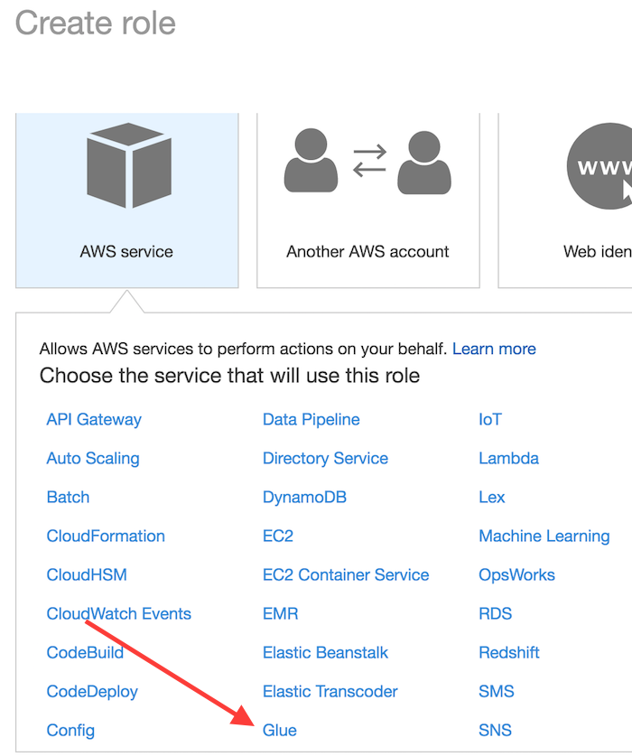
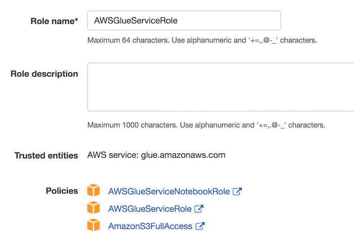
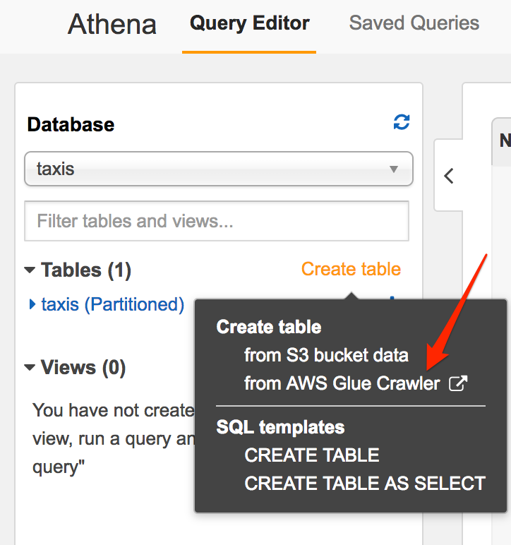
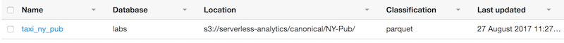

# Part 2 - Automating Table Creation

## References
1. [AWS Glue API documentation](http://docs.aws.amazon.com/glue/latest/dg/aws-glue-api.html)

2. [Setting up IAM Permissions for AWS Glue](http://docs.aws.amazon.com/glue/latest/dg/getting-started-access.html)

## Prerequisits
1. Create an [AWS account](https://aws.amazon.com/free/)

## Setup IAM Permissions for AWS Glue
1. Access the IAM console and select **Users**.  Then select your username

2. Click **Add Permissions** button

3. From the list of managed policies, attach the following:
	* AWSGlueConsoleFullAccess
	* CloudWatchLogsReadOnlyAccess
	* AWSCloudFormationReadOnlyAccess

## Setup AWS Glue default service role
1. From the IAM console click **Roles** and create a new role

2. Select **Glue** from the list of services and click the **Next:Permissions** button



4. From the list of managed policies, attach the following by searching for their name and click **Next:Review** when done.
	* AWSGlueServiceRole
	* AWSGlueServiceNotebookRole
	* AmazonS3FullAccess

5. Give your role a name, such as **AWSGlueServiceRole** and click **Create Role**



## Creating an Athena Table using Glue Crawler

1. Open the Athena console

2. From the **Database** pane on the left hand side, click **Create Table** drop down and select **from AWS Glue Crawler**
> Note: If you see **Add Table** link it either means you are using Athena where Glue is not yet available, so switch to N. Virginia or you have not migrated Athena to use the Glue Data Catalog, do so by clicking **Migrate** when prompted or follow these [instructions](http://docs.aws.amazon.com/athena/latest/ug/glue-upgrade.html).



3. Enter a name for the crawler.  Click Next.

4. Select the **Specify path in another account** radio button and enter **s3://serverless-analytics/canonical/NY-Pub/** for the S3 path.  Click Next.

5. Do **not** add another data source and click Next.

6. Select **Choose an existing IAM role** and select the **AWSGlueServiceRole** from the dropdown.  Click Next.

6. For frequency leave as **Run on Demand** and click Next.

7. Click **Add Database** button and give your database a name, say **labs**

8. In order to avoid table name collision Glue generates a unique table name so we'll need to provide a prefix, say **taxi_** (include the underscore)

9. Click **Finish**

10. Check the box next to your newly created crawler and click **Run Crawler**.  It should take about a minute to run and create our table.


## Exploring Glue Data Catalog
1. On the left hand side, click **Databases**

2. Find the **labs** database and click on it

3. Click **Tables in labs** to view our newly created table



4. Click the table name and explore

## Querying Taxi Data
1. Switch back to the Athena console

	* You may need to replace the database and/or table names with ones shown in the Data Catalog.

2. Enter `SHOW PARTITIONS labs.taxi_ny_pub` to verify all partitions were automatically added

3. Try the SQL statement below to explore the data.

```sql
SELECT *
FROM labs.taxi_ny_pub
WHERE year BETWEEN '2013' AND '2016' AND type='yellow'
ORDER BY pickup_datetime desc
LIMIT 10;
```

