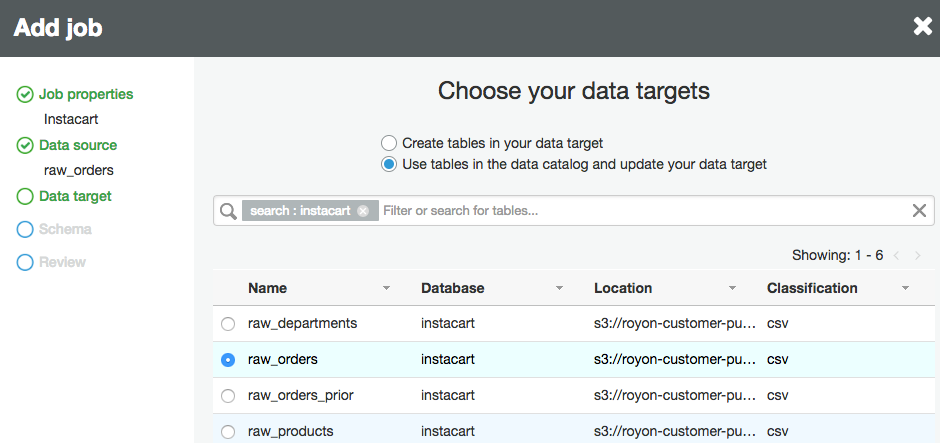
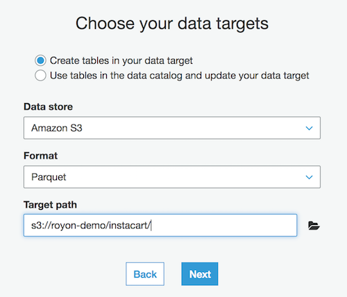
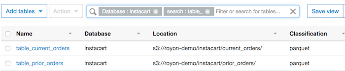

# Part 3 - Crawling, Transforming and Querying

## References
1. [Apache Spark](https://spark.apache.org/)

2. [PySpark API Reference](http://spark.apache.org/docs/2.1.0/api/python/pyspark.sql.html)


## The Data Source
We will use a public data set provided by [Instacart in May 2017](https://tech.instacart.com/3-million-instacart-orders-open-sourced-d40d29ead6f2) to look at Instcart's customers' shopping pattern.  You can find the data dictionary for the data set [here](https://gist.github.com/jeremystan/c3b39d947d9b88b3ccff3147dbcf6c6b)

## Crawling
1. Open the AWS Glue console

2. Select **Crawler** and click **Add Crawler**
3. Give your crawler a name.
4. Select **S3** as the **Data Source** and specify a path in **another account**.  Paste **s3://royon-customer-public/instacart/** as the S3 path.
5. Do **not** add another data source and click Next.
6. Select **Choose an existing IAM role** and select the **AWSGlueServiceRole** from the dropdown.  Click Next.
6. For frequency leave as **Run on Demand** and click Next.
6. Create a new database called **instacart** and enter **raw_** as the table prefix
7. Click **Finish** to complete creating the crawler
8. Run the new crawler

##  Transforming the Data
Before we get started with creating a Glue ETL job, we need to make one small change to the created tables.
Select Tables in the Data Catalog and search for **raw_products**. Click **raw_products** to open up the table details.
As you can see the Classification is *UNKNOWN*.  We need to fix it before continuing.
1. Click **Edit Table**

2. Scroll down to **Classification** and change the value to **csv**
3. Click **Apply** to save the changes
You may have also noticed that we don't have any column, that's ok, we'll fix this soon.

We'll now create an ETL job that will process all 4 tables that the crawler created, combine them into a single table and save in a Parquet optimized file format.

From the Glue ETL menu select **Jobs** and click **Add Job**
1. Give your job a name, **instacart_etl** and select our service role.  Leave all of the other options unchanged.

2. From the **Data Sources** list select one of the Instcart tables, lets say **raw_orders**.  We can only select one table.



3. When choosing our data targets select **Create tables in your data target**. Select **Amazon S3** for data store and **Parquet** for format.  Choose a name for a new S3 bucket `s3://<your_bucket_name>/`



4. In this step we can change the source to target column mapping but we will not change this now.  Click **Next**

5. Click **Finish** to complete creating our ETL

As you can see, AWS Glue created a script for you to get started.  If we didn't need to do anything else, this script simply converts our CSV data to Parquet.
If you remember we still need to fix the Products table.  Select everything in the script window and replace it with the code below.

>Make sure you update `OUTPUT_S3_PATH` to point to your own S3 bucket, otherwise the job will fail.

```python
import sys
from awsglue.transforms import *
from awsglue.utils import getResolvedOptions
from pyspark.context import SparkContext
from awsglue.context import GlueContext
from awsglue.dynamicframe import DynamicFrame
from awsglue.job import Job

##################
## Update these variables with your own information
##################
DB_NAME = "instacart"

TBL_RAW_PRODUCTS = "raw_products"
TBL_RAW_ORDERS = "raw_orders"
TBL_RAW_ORDERS_PRIOR = "raw_orders_prior"
TBL_RAW_DEPT = "raw_departments"

OUTPUT_S3_PATH = "s3://your_bucket/instacart/"
##################

## @params: [JOB_NAME]
args = getResolvedOptions(sys.argv, ['JOB_NAME'])

## Create Glue and Spark context variables
sc = SparkContext()
glueContext = GlueContext(sc)
spark = glueContext.spark_session
job = Job(glueContext)
job.init(args['JOB_NAME'], args)

## Define the source tables from where to read data
products = glueContext.create_dynamic_frame.from_catalog(database = DB_NAME, table_name = TBL_RAW_PRODUCTS, transformation_ctx = "products").toDF()
orders = glueContext.create_dynamic_frame.from_catalog(database = DB_NAME, table_name = TBL_RAW_ORDERS, transformation_ctx = "orders").toDF()
orders_prior = glueContext.create_dynamic_frame.from_catalog(database = DB_NAME, table_name = TBL_RAW_ORDERS_PRIOR, transformation_ctx = "orders_prior").toDF()
departments = glueContext.create_dynamic_frame.from_catalog(database = DB_NAME, table_name = TBL_RAW_DEPT, transformation_ctx = "departments").toDF()

## Fix the products table which was missing columns and types
p_df = products.withColumn('product_id', products.col0.cast('bigint')) \
.withColumn('product_name', products.col1.cast('string')) \
.withColumn('aisle_id', products.col2.cast('bigint')) \
.withColumn('department_id', products.col2.cast('bigint')) \
.na.drop('any')
df = p_df.select('product_id', 'product_name', 'aisle_id', 'department_id')

## Join the prior orders table with the products table
priors_products = orders_prior.join(df, ['product_id'])

## Join the previously join table with the departments table
orders_prod_dept = priors_products.join(departments, ['department_id'])

## Disable writing out metadata files
sc._jsc.hadoopConfiguration().set('parquet.enable.summary-metadata', 'false')

## Write out the current orders table to S3 partitioned by order day of week
orders.coalesce(10).write.partitionBy('order_dow').mode('overwrite').parquet(OUTPUT_S3_PATH + 'current_orders/')

## Write out the joined table partitioned by department name
orders_prod_dept.coalesce(10).write.partitionBy('department').mode('overwrite').parquet(OUTPUT_S3_PATH + 'prior_orders/')

job.commit()
```

Now save and run your ETL job.  One thing to note is that we're writing out a new set of data to our own S3 bucket.
We need to configure a crawler to scan this new bucket and create appropriate tables in the Data Catalog so we can query them with Athena.

There is a little bit of cleanup we need to do in order to help the crawler produce better results.  When Apache Spark, what is used by the Glue ETL, does its work
it generates some temporary files. We will need to delete them.  In the output S3 bucket delete files named **name_$folder$**, **_metadata** and **_common_metadata**

From the Glue console select **Crawlers** and create a new crawler.  Point it to the top S3 bucket where you saved your results defined by **OUTPUT_S3_PATH** in the script above.  In my case that will be **s3://royon-demo/instacart/**.  Make sure you configure the table prefix to something other than raw_ so you can differentiate them from the previous ones we created, I used **table_**.  When the ETL job completes we can run our new crawler.  After the crawler completes you should see your new tables.



Go ahead and explore the data.  Here is an example SQL query that counts orders and groups them by department.

```sql
SELECT count(*) AS count, department
FROM instacart."table_prior_orders"
GROUP BY department
```

Here is another example that counts the number of users that have placed orders during their lunch hour from 11am to 1pm grouped by the days of the week the order was placed.

```sql
SELECT count(user_id) as user_count, order_dow
FROM instacart."table_current_orders"
WHERE eval_set='prior' AND order_hour_of_day BETWEEN 11 and 13
GROUP BY order_dow
ORDER BY user_count desc
```

## Clean up
When you finish all of the parts of this lab delete the bucket you created to store the job output.
