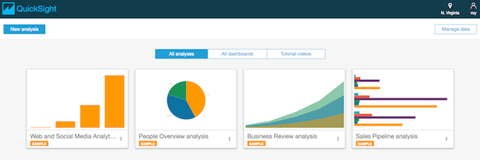
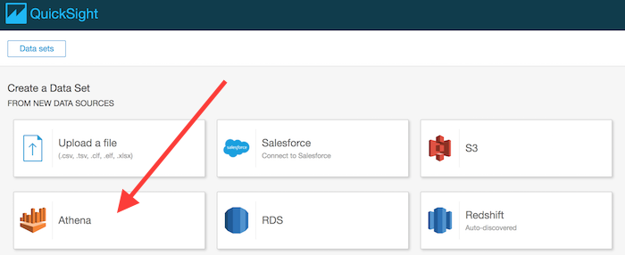
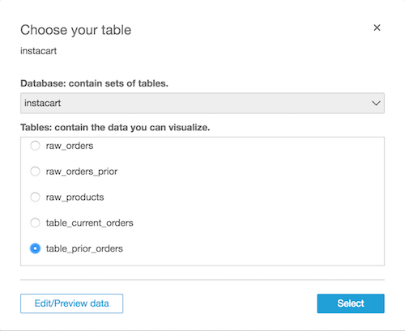
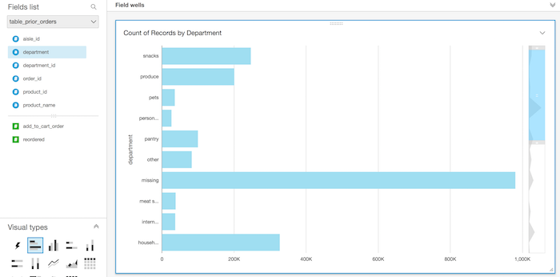
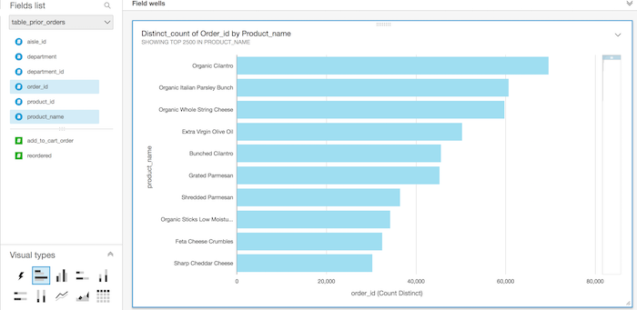

# Part 4 - Visualizing Data with QuickSight

## References
1. [Managing Amazon QuickSight Permissions](http://docs.aws.amazon.com/quicksight/latest/user/managing-permissions.html)

2. [Creating Datasets using Amazon Athena](http://docs.aws.amazon.com/quicksight/latest/user/create-a-data-set-athena.html)

## Setting up permissions
Amazon QuickSight manages its own set of users and therefore you need to have an administrator account that is allowed to create new users.
We'll use your current user as the administrator and therefore we'll need to add additional permissions for it to do its job.

QuickSight does not have a managed policy so we'll need to create one and then associate it with our user.

1. Open the IAM console

2. From the left hand side menu select **Policies** and click the Create Policy button

3. Select **Create Your Own Policy**

4. Name your policy **QuicksightPolicy** and enter the following into the **Policy Document** text box

```
{
    "Statement": [
        {
            "Action": [
                "quicksight:*"
            ],
            "Effect": "Allow",
            "Resource": "*"
        }
    ],
    "Version": "2012-10-17"
}
```

5. Once created, select your username again from the **Users** section and add permissions as you've done previously.  Search for **QuicksightPolicy** and add it.

6. Also add the following managed policies to your user
    * IAMFullAccess
    * AWSQuicksightAthenaAccess

## Connecting with Amazon QuickSight
To explore the Instacart data we previously created we need to login to Amazon QuickSight and create a data set directly from Amazon Athena.

1. Open the QuickSight console

2. If it's your first time you'll be asked to enter an email address to create an account.  If you've accessed QuickSight before you'll land in the main window



2. Update the region (shown in the top right corner) if it does not match the one you used in part 3 of this lab.

3. Next we'll need modify QuickSight's permissions to be able to access Athena and S3.  From the top right corner, click on your user icon and select **Manage QuickSight**
From the left hand side menu select **Account Settings** and click the **Manage QuickSight permissions to AWS resources** button under QuickSight permissions to AWS resources.

4. On the permissions screen, tick the box for **Amazon Athena** and **Amazon S3**.  When asked to select S3 buckets, select all buckets. Click **Apply** and go back to the main screen.

5. Click the **New Analysis** button at the top left of the screen

6. Click **New Data Set** and select **Athena** from the list of sources



7. Give your data source a name and click **Create data source**

8. Select the **Instacart** database we created in Part 3 of this lab

9. Select the `table_prior_orders` as a starting point for us to explore



10. Select to **Directly query your data** and click **Visualize**

At this point you are presented with a blank graph so feel free to play around and build interesting visualizations.

For example, here is a graph of the count of customer orders that include items from each department



Here is another example of the top purchased products by the total number of customer orders


